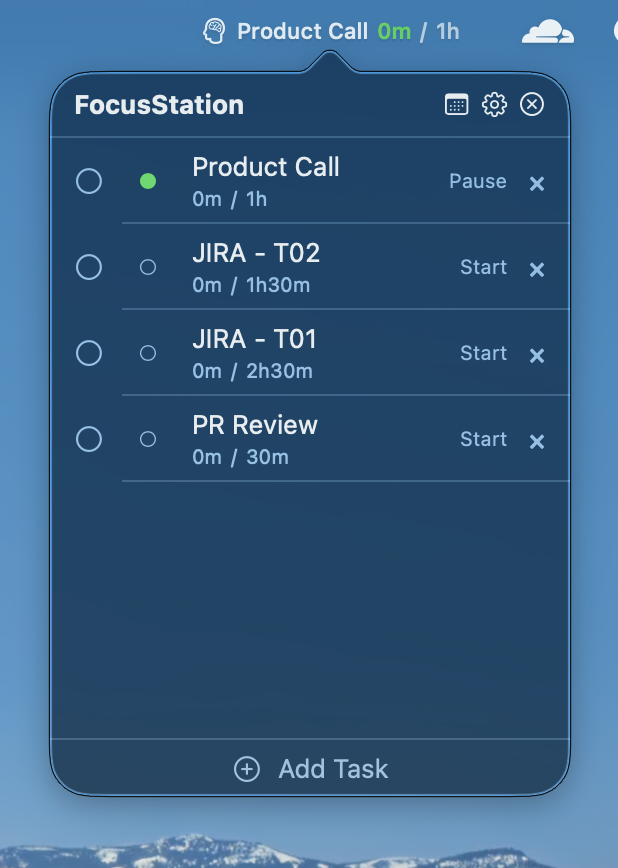

<p align="center">
  
</p>

# FocusStation

**A native macOS menu bar task timer. Track your time, stay focused — zero friction.**

[](https://swift.org)
[](https://developer.apple.com/xcode/swiftui/)
[](https://developer.apple.com/xcode/swiftdata/)
[](https://developer.apple.com/macos/)
[](LICENSE)

FocusStation lives in your Mac's menu bar. Add tasks, start a timer, and your progress is always one glance away. No accounts, no cloud, no complexity — just you and your work.

---

## Screenshots

<p align="center">
  
</p>

---

## Getting Started

### Requirements
- macOS 14 (Sonoma) or later
- Xcode 16 or later

### Build
```bash
git clone https://github.com/gaju91/focusStation.git
cd focusStation
xcodebuild -project FocusStation.xcodeproj -scheme FocusStation -configuration Debug build
open ~/Library/Developer/Xcode/DerivedData/FocusStation-*/Build/Products/Debug/FocusStation.app
```

**That's it.** Zero dependencies. Zero package managers. Zero third-party code.

---

## Project Structure

```
FocusStation/                         # All source code
│
├── App/                              # Entry point + environment + schema
│   ├── FocusStationApp.swift         # @main struct — DI, Settings scene
│   ├── ModelContainer+App.swift      # SwiftData schema + on-disk store
│   └── EnvironmentKeys.swift         # @Entry for TimerManagerProtocol
│
├── Models/                           # SwiftData @Model classes
│   ├── Task.swift                    # name, icon, timer state, target time
│   └── Day.swift                     # ArchivedDay + ArchivedTask snapshots
│
├── Services/                         # Business logic — no UI dependencies
│   ├── TimerManagerProtocol.swift    # 13-member contract for timer CRUD
│   ├── TimerManager.swift            # @Observable timer authority
│   ├── TimerManager+SleepWake.swift  # NSWorkspace sleep/wake → pause timers
│   ├── TickGenerator.swift           # @MainActor 1s @Observable tick source
│   └── MenuBarController.swift       # NSStatusBar + NSPopover lifecycle
│
├── ViewModels/                       # MVVM bridge — @Observable, no SwiftUI imports
│   └── DropdownViewModel.swift       # Task list, CRUD, sorting, sync timer
│
├── Views/                            # SwiftUI only — no business logic
│   ├── MenuBar/
│   │   ├── StatusBarLabelView.swift   # Brain icon ● name elapsed / target
│   │   ├── MenuBarLabelView.swift     # Passes tickGenerator + timerManager
│   │   └── MenuBarContainerView.swift # NSHostingView wrapper (avoids AnyView)
│   ├── Dropdown/
│   │   ├── DropdownView.swift         # Task list panel (NSPopover content)
│   │   ├── TaskRowView.swift          # Checkbox, state dot, name, time, delete
│   │   ├── AddTaskSheet.swift         # New/Edit task form with target time
│   │   └── EmptyStateView.swift       # "No tasks yet" placeholder
│   └── Settings/
│       ├── SettingsView.swift         # TabView container (600×460)
│       ├── GeneralSettingsTab.swift   # Launch at login, sleep/wake, data reset
│       ├── AppearanceSettingsTab.swift # Hide completed tasks
│       └── BehaviorSettingsTab.swift  # Single-timer enforcement (read-only)
│
├── Utilities/                        # Pure functions, zero state
│   ├── TimeFormatter.swift           # TimeInterval → "1h30m" / "45m"
│   └── IconProvider.swift            # 32 SF Symbol registry + default icon
│
└── Resources/
    └── Info.plist                    # LSUIElement = true (hide from Dock)
```

---

## Architecture

### Pattern: MVVM + @Observable

```
┌──────────┐     reads      ┌──────────────┐     calls     ┌─────────────┐
│   View   │ ←───────────── │  ViewModel   │ ────────────→ │   Service   │
│ (SwiftUI)│                │ (@Observable)│               │(TimerManager)│
└──────────┘                └──────────────┘               └──────┬──────┘
                                                                  │
                                                            reads/writes
                                                                  │
                                                            ┌─────▼──────┐
                                                            │ SwiftData  │
                                                            │ (on disk)  │
                                                            └────────────┘
```

- **Views** render pixels. No `if` business logic, no SwiftData access.
- **ViewModels** (`@Observable` classes) prepare data. Import `Observation`, never `SwiftUI`.
- **Services** own state. `TimerManager` is the sole mutation point for tasks.
- **SwiftData** persists everything locally. `ModelContainer.appContainer` is a static factory.

### Timer Engine — Timestamp-Based, Zero Drift

```swift
func currentElapsed() -> TimeInterval {
    guard isRunning, let startedAt else { return accumulatedElapsed }
    return accumulatedElapsed + Date.now.timeIntervalSince(startedAt)
}
```

- **No counters.** `elapsed += 1` never appears — that drifts and breaks on sleep.
- **Started timestamp** recorded on start/resume. Paused captures elapsed into `accumulatedElapsed`.
- **Live display** computed on every render: `accumulated + (now - startedAt)`.
- **Sleep-safe** — on wake, the math accounts for elapsed wall-clock time automatically.

### Menu Bar — NSStatusBar + NSPopover

The initial `MenuBarExtra` approach was abandoned because SwiftUI clips label content to ~40px. The current implementation uses:

- `NSStatusBar.system.statusItem(withLength: 180)` — fixed-width item, no clipping.
- `NSHostingView<MenuBarContainerView>` — embedded SwiftUI inside the status button.
- `NSPopover` with `.transient` behavior + `NSHostingController` — dropdown panel.
- `TickGenerator` (`@Observable`, 1s timer) — drives `withObservationTracking` in `MenuBarController` to re-render the label each second.
- `NSApp.effectiveAppearance` synced each tick in `updateLabel()` for dark/light mode.

### Single-Timer Enforcement

`TimerManager.start()` and `resume()` both call `pauseOtherRunningTasks(except:)` — starting or resuming a task automatically pauses any currently running task. This is mandatory, not optional.

### Protocol-Based DI

```swift
protocol TimerManagerProtocol: AnyObject {
    var tasks: [Task] { get }
    func start(task: Task)
    func pause(task: Task)
    // ... 13 total members
}
```

`NoOpTimerManager` (empty implementation) serves as the `@Entry` default. The real `TimerManager` is created in `FocusStationApp.init()` and injected. ViewModels depend on `any TimerManagerProtocol`, never the concrete class. Testable via mock.

---

## File Responsibility Guide

### `App/`

| File | Responsibility |
|---|---|
| `FocusStationApp.swift` | `@main` entry point. Creates `ModelContainer`, `TimerManager`, `TickGenerator`, `MenuBarController`. Provides Settings scene. |
| `ModelContainer+App.swift` | Static `ModelContainer.appContainer` factory. Schema: `Task`, `Day`, `ArchivedTask`. On-disk store. |
| `EnvironmentKeys.swift` | `@Entry var timerManager`. Defaults to `NoOpTimerManager`. Overridden via `.environment(\.timerManager, ...)` in `MenuBarController`. |

### `Models/`

| File | Responsibility |
|---|---|
| `Task.swift` | `@Model` class. Properties: `name`, `iconName`, `isRunning`, `isCompleted`, `accumulatedElapsed`, `startedAt`, `targetTime`, `displayOrder`. `currentElapsed()` is computed from timestamps. `displayState` derives `.running`/`.paused`/`.idle`/`.completed`. |
| `Day.swift` | `@Model` for archived daily snapshots + `ArchivedTask` frozen task state. Schema present for forward compatibility. |

### `Services/`

| File | Responsibility |
|---|---|
| `TimerManagerProtocol.swift` | 13-member `AnyObject` protocol. Contract for all timer mutations + task CRUD. |
| `TimerManager.swift` | `@Observable` implementation. Owns `tasks: [Task]`, `modelContext`, display timer, `refreshTasks()`. `start`/`pause`/`resume` enforce single-timer. `swapTasks(_:with:)` for reorder. |
| `TimerManager+SleepWake.swift` | `NSWorkspace` notif observers. On sleep: pause all + stop display timer. On wake: restart display timer. |
| `TickGenerator.swift` | `@MainActor @Observable`. Runs a 1s recurring `Timer` on `RunLoop.main.common`. `value` incremented each tick — observed by `MenuBarController` to trigger label re-renders. |
| `MenuBarController.swift` | `@MainActor` class. Creates `NSStatusItem` (180px), `NSHostingView` for label, `NSPopover` for dropdown. Click toggle, `withObservationTracking` tick loop, appearance sync. |

### `ViewModels/`

| File | Responsibility |
|---|---|
| `DropdownViewModel.swift` | `@Observable`. Syncs `tasks` from `timerManager` every 1s. Exposes `sortedTasks` (running → paused → idle → completed). Handles `startTask`, `pauseTask`, `resumeTask`, CRUD passthrough, `swapAdjacent` for move up/down. `deinit` invalidates sync timer. |

### `Views/MenuBar/`

| File | Responsibility |
|---|---|
| `StatusBarLabelView.swift` | Renders the menu bar label: `🧠 Research 1h23m / 3h00m` for running tasks (green time), `🧠 Research 45m` for paused (orange), brain icon for idle. Time hidden when `elapsed == 0`. Zero-width components omitted by `TimeFormatter`. |
| `MenuBarLabelView.swift` | Bridges `TickGenerator` + `timerManager` to `StatusBarLabelView` with `.id(tickGenerator.value)` for re-rendering. |
| `MenuBarContainerView.swift` | Concrete typed wrapper around `StatusBarLabelView`. Exists solely to avoid `AnyView` in `NSHostingView` (breaks `intrinsicContentSize`). |

### `Views/Dropdown/`

| File | Responsibility |
|---|---|
| `DropdownView.swift` | `NSPopover` content. Header (title + Settings + Quit), task list (scrollable, hide-completed toggle), Add Task footer. Min height 340px to prevent popover resize. |
| `TaskRowView.swift` | Single row: completion checkbox, state dot (green/orange/gray), name + time / target, hover reveal reorder buttons, action button (Start/Pause/Resume), delete (×). Context menu for alternate actions. |
| `AddTaskSheet.swift` | Inline form (not a sheet). Name field with validation, target hours/minutes steppers. Edit mode pre-fills existing values. "Save & Add Another" for bulk creation. |
| `EmptyStateView.swift` | Static placeholder when no tasks exist. |

### `Views/Settings/`

| File | Responsibility |
|---|---|
| `SettingsView.swift` | `TabView` with General, Appearance, Behavior tabs. Frame 600×460. |
| `GeneralSettingsTab.swift` | Launch at Login (`SMAppService`), Pause/Resume on Sleep toggles, Reset All Data (with confirmation alert). |
| `AppearanceSettingsTab.swift` | Hide Completed Tasks toggle. |
| `BehaviorSettingsTab.swift` | Informational: single-timer enforcement description. |

### `Utilities/`

| File | Responsibility |
|---|---|
| `TimeFormatter.swift` | `static func format(TimeInterval) -> String`. Returns `"1h30m"`, `"45m"`, `"30s"`, `"24h+"`, `"0m"`. Omits zero components. |
| `IconProvider.swift` | 32 SF Symbol names. `defaultIcon = "brain.head.profile"`. `label(for:)` for human-readable display. |

---

## Guardrails

These checks are enforced in CI and block merges. Run locally before submitting:

```bash
# Build must succeed with zero warnings
xcodebuild -project FocusStation.xcodeproj -scheme FocusStation -configuration Debug build

# No force unwraps (use guard let / if let)
grep -rn '!' FocusStation/ --include='*.swift' | grep -v '!=' | grep -v 'fatalError'

# No debug prints
grep -rn 'print(' FocusStation/ --include='*.swift'

# No counter-based timers (use timestamps)
grep -rn 'elapsed += 1' FocusStation/ --include='*.swift'

# No legacy property wrappers (use @Observable)
grep -rn '@Published\|ObservableObject\|@StateObject' FocusStation/ --include='*.swift'

# No hardcoded colors (use semantic colors for dark mode)
grep -rn 'Color\.black\|Color\.white\|Color(red:\|Color(hex:' FocusStation/ --include='*.swift'

# No Combine (use @Observable + withObservationTracking)
grep -rn 'import Combine\|Combine\.' FocusStation/ --include='*.swift'

# No raw UserDefaults writes (use @AppStorage)
grep -rn 'UserDefaults.standard.set\|UserDefaults.standard.removeObject' FocusStation/ --include='*.swift'
```

### Must Always

- `guard let` / `if let` — never force-unwrap
- `@Observable` only — never `@Published` / `ObservableObject` / `@StateObject`
- `currentElapsed()` = timestamp diff — never `elapsed += 1`
- Semantic colors only — `.primary`, `.secondary`, `.green`, `.orange`, `.accentColor`
- Imports sorted alphabetically: Foundation → SwiftData → SwiftUI → AppKit → Observation
- `///` doc comments on every public type, method, and property
- ViewModels import `Observation` (not `SwiftUI`); Views import `SwiftUI` (and `AppKit` only when needed)

---

## Contributing

1. Fork the repo
2. Create a branch: `feature/your-feature` or `fix/your-bug`
3. Write code following the conventions above
4. Run all guardrail checks — they must pass
5. Submit a PR with a clear description

### Commit Style
```
area: short description in present tense

- Bullet points for what changed
- Reference issues if applicable
```

### Project Values
- **Zero dependencies.** Everything uses Apple frameworks only.
- **Local-only.** No networking. No analytics. No accounts.
- **Timestamp-based timer.** Never increment a counter.
- **Small surface area.** One feature per file. Clear responsibilities.

---

## Tech Stack

| Layer | Technology |
|---|---|
| Language | Swift 6 |
| UI | SwiftUI (no AppKit views except NSStatusBar/NSPopover) |
| Persistence | SwiftData (on-disk, local only) |
| Concurrency | `@MainActor` + `@Observable` + `withObservationTracking` |
| Menu Bar | `NSStatusBar` + `NSHostingView` (not MenuBarExtra) |
| Build | Xcode 16, zero package dependencies |

---

## License

MIT — see [LICENSE](LICENSE) for details.
